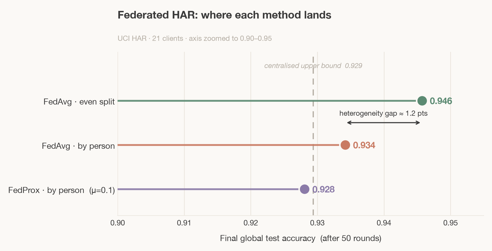

# fed-har — Federated Human Activity Recognition

Federated learning on the UCI HAR dataset. Twenty-one simulated phones train
one shared activity-recognition model **without ever pooling their raw sensor
data** — only model updates are exchanged. FedAvg and FedProx are implemented
from scratch (no federated-learning library) to demonstrate the mechanism, then
measured against a centralised upper bound.

## What this project shows

- A **centralised baseline** — one model that sees all data — as the upper bound.
- **FedAvg** (McMahan et al., 2017), implemented from scratch.
- **FedProx** (Li et al., 2020), FedAvg plus a proximal term, for the harder case.
- The effect of **data heterogeneity**: the same algorithm is run on an even
  (IID) client split and a realistic by-person (non-IID) split, and the
  accuracy gap between them is quantified.

## Dataset

UCI Human Activity Recognition Using Smartphones (Anguita et al., 2013).
Thirty volunteers wore a waist-mounted smartphone performing six activities
(walking, walking upstairs, walking downstairs, sitting, standing, laying);
accelerometer and gyroscope signals are provided as 561 pre-computed features
per window. Every row is tagged with the person it came from, so each person
can be treated as one federated client. The official train/test split is kept:
21 people become clients; the 9 test people form a global test set no client
trains on.

The dataset is not committed. It downloads into `data/` (see Setup) and is
ignored by git.

## Results

All runs use 50 communication rounds, 30% of clients sampled per round, and
3 local epochs per selected client.

| Setting | Final test accuracy | Note |
|---|---|---|
| Centralised (upper bound) | 0.929 | sees all data |
| FedAvg — even split | 0.946 | easy (IID) case |
| FedAvg — by person | 0.934 | realistic, harder (non-IID) |
| FedProx — by person (μ=0.1) | 0.928 | stabilised variant |

**Key findings (reported honestly):**

1. **On IID data, federated learning matches centralised.** FedAvg on the even
   split (0.946) reaches the centralised upper bound (0.929) — the repeated
   averaging behaves like mild regularisation. Privacy costs essentially nothing
   when clients are similar.

2. **Heterogeneity has a small but real cost.** Moving from the even split to the
   realistic by-person split drops FedAvg by ~1.2 points (0.946 → 0.934), and the
   by-person learning curve is visibly noisier.

3. **FedProx did not improve on FedAvg here.** At μ=0.1 it reached 0.928, slightly
   below FedAvg's 0.934; a μ=0.5 robustness check gave 0.929 — no meaningful
   difference. This is consistent with FedProx being designed for *severe*
   non-IID settings: UCI HAR's per-person heterogeneity is mild enough that the
   proximal penalty mostly restrains useful local learning rather than
   correcting instability. The method is implemented and tested correctly; the
   negative result is the honest finding.

## Setup
python3 -m venv .venv
source .venv/bin/activate
pip install -r requirements.txt

Download the dataset:
mkdir data
curl -L -o data/har.zip "https://archive.ics.uci.edu/static/public/240/human+activity+recognition+using+smartphones.zip"
unzip -q data/har.zip -d data/
unzip -q "data/UCI HAR Dataset.zip" -d data/

## Running

python data_loader.py # sanity-check the data loads
python centralised.py # centralised upper bound
python fedavg.py even # FedAvg, IID split
python fedavg.py by_person # FedAvg, non-IID split
python fedprox.py by_person # FedProx, non-IID split
python plot_results.py # build the comparison figure

Each federated run saves its accuracy-per-round history to `results/`, and
`plot_results.py` reads those to draw `comparison.png`.

## Limitations and next steps

- Clients here are simulated and always available; real devices are slower,
  drop out, and vary in hardware.
- UCI HAR's mild heterogeneity limits how much FedProx can help — a sharper
  non-IID benchmark would test it more fairly.
- The natural next layer is privacy: clipping and noising updates (differential
  privacy) and secure aggregation, with the resulting accuracy–privacy
  trade-off measured explicitly.

## References

Anguita, D., Ghio, A., Oneto, L., Parra, X. and Reyes-Ortiz, J.L. (2013) 'A public domain dataset for human activity recognition using smartphones', *ESANN 2013*, Bruges, Belgium.

Li, T., Sahu, A.K., Zaheer, M., Sanjabi, M., Talwalkar, A. and Smith, V. (2020) 'Federated optimization in heterogeneous networks', *Proceedings of Machine Learning and Systems*, 2, pp. 429–450.

McMahan, H.B., Moore, E., Ramage, D., Hampson, S. and Arcas, B.A. (2017) 'Communication-efficient learning of deep networks from decentralized data', *Proceedings of the 20th International Conference on Artificial Intelligence and Statistics (AISTATS)*, pp. 1273–1282.